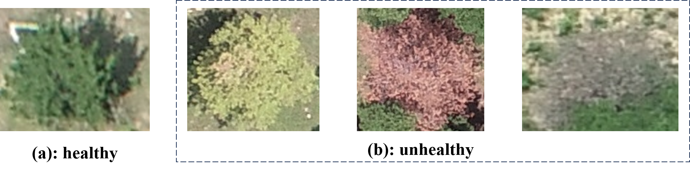
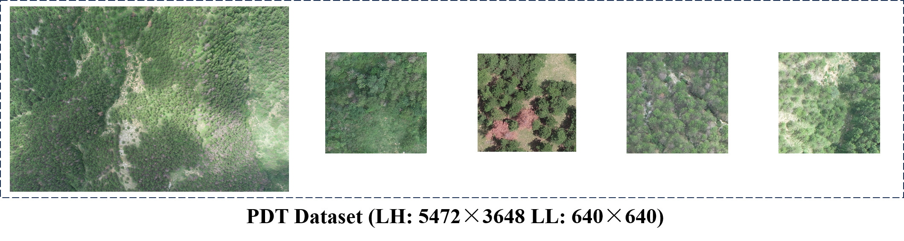
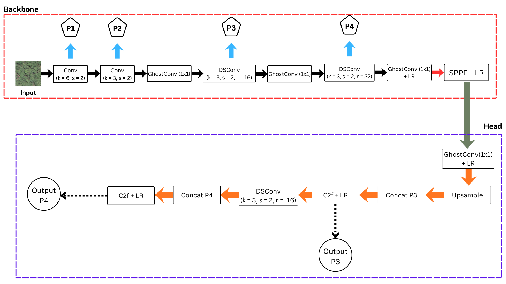

## Abstract

Autonomous UAV-based plant protection operations require high-precision object detection models that can effectively identify dense, small-scale targets such as agricultural pests, diseases, and weeds in real-time. While the advanced YOLO-DP baseline (proposed in *"PDT: Uav Target Detection Dataset for Pests and Diseases Tree"*) achieves outstanding accuracy, its high computational complexity poses significant challenges for deployment on resource-constrained edge devices like NVIDIA Jetson or Raspberry Pi.

Our optimized model delivers an optimal balance between latency, model size, and accuracy directly on edge computing hardware.

## Download Dataset
**Hugging Face:** [PDT dataset v2 (Improve the quality 2024.10.4)](https://huggingface.co/)

## Code
**GitHub:** [YOLO-DP-Tiny](https://github.com/hoangthh810/Lightweight-YOLO-DP)

## Datasets
### PDT dataset

**Class:** unhealthy

(a) is a healthy goal and (b) is an unhealthy goal. The PDT dataset takes (b) as the category.

**Double Resolution:**

## Dataset Structure

| Edition | Classes | Structure | Targeted images | Untargeted images | Image size | Instances | Target Amount   S(Small)   M(Medium)   L(Large) |
| :---: | :---: | :---: | :---: | :---: | :---: | :---: | :---: |
| **Sample** | unhealthy | Train | 81 | 1 | $640 \times 640$ | 2569 | 1896 548 179 |
| | | Val | 19 | 1 | $640 \times 640$ | 691 | 528 138 25 |
| **LL** | unhealthy | Train | 3166 | 1370 | $640 \times 640$ | 90290 | 70418 16342   3530 |
| | | Val | 395 | 172 | $640 \times 640$ | 12523 | 9926 2165 432 |
| | | Test | 390 | 177 | $640 \times 640$ | 11494 | 8949 2095 450 |
| **LH** | unhealthy | - | 105 | 0 | $5472 \times 3648$ | 93474 | 93474 0 0 |

## Models

### Network Structure

## References

This project is built upon and improves the baseline architecture proposed in the following paper:

* **Paper Title:** PDT: Uav Target Detection Dataset for Pests and Diseases Tree
* **Authors:** Mingle Zhou, Rui Xing, Delong Han, Zhiyong Qi, Gang Li
* **Preprint:** [arXiv:2409.15679](https://arxiv.org/pdf/2409.15679)

